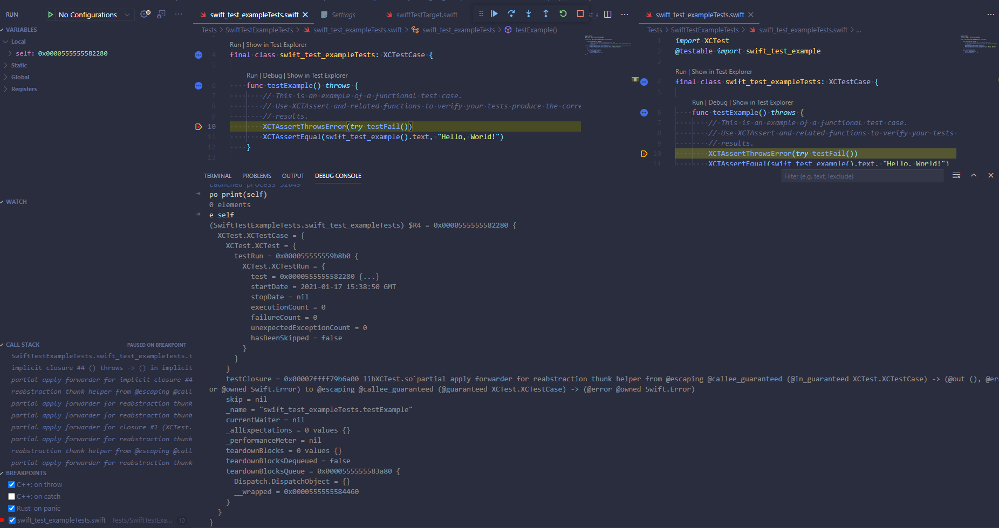
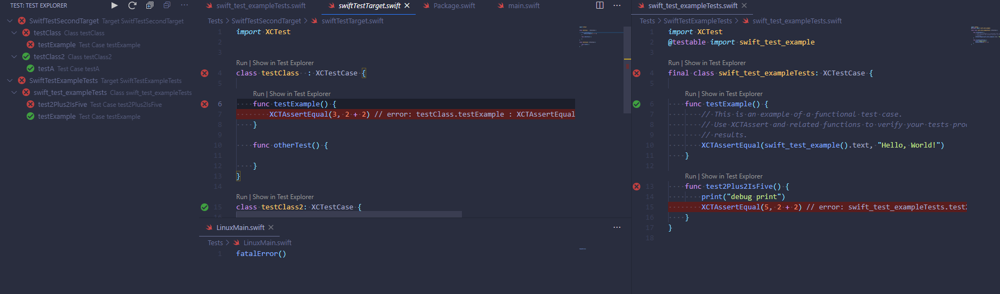

# Swift Test Adapter for Visual Studio Code

This extension for [Text Explorer UI](https://marketplace.visualstudio.com/items?itemName=hbenl.vscode-test-explorer) add ide test capabilities with swift SPM in VSCode and also integrates with [CodeLLDB](https://marketplace.visualstudio.com/items?itemName=vadimcn.vscode-lldb) to enable debug capabilities but it doesn't depend from it. Install it only if you want to enable debug capabilities

## Features

 * **Debug** on linux
 * Reload test lists on save if a test file changes (_Configurable_)
 * Run single test or all tests in a class or all test in a target instead of `swift test` everything everytime
 * Detects test file location and line
 * Highlights test failed lines with output
 * Prints test run output

## Screenshots

Example of running debug



Example of run tests


## Missing Features
 * AutoRun
 * Parallel tests (but not likelly at this moment)
 * Code Coverage

## Debug
As already mentioned this extension is capable to debug code integrating with the **CodeLLDB** extension. You can reference their [user manual](https://github.com/vadimcn/vscode-lldb/blob/master/MANUAL.md#alternate-lldb-backends) on how to set up the correct liblldb path for the extension to work, then it should work out of the box when selecting the test case to debug.

If you see an error like this
```
Could not initialize Python interpreter - some features will be unavailable (e.g. debug visualizers).
```
in the debug console it's actually a problem with the distributed version of `swift lldb` and it doesn't seem to cause any problem

## Support

This extension is really new so I suppose bugs will be frequent, feel free to open any [issue](https://github.com/MFranceschi6/vscode-swift-test-adapter/issues) if you find something or you want to propose a new feature